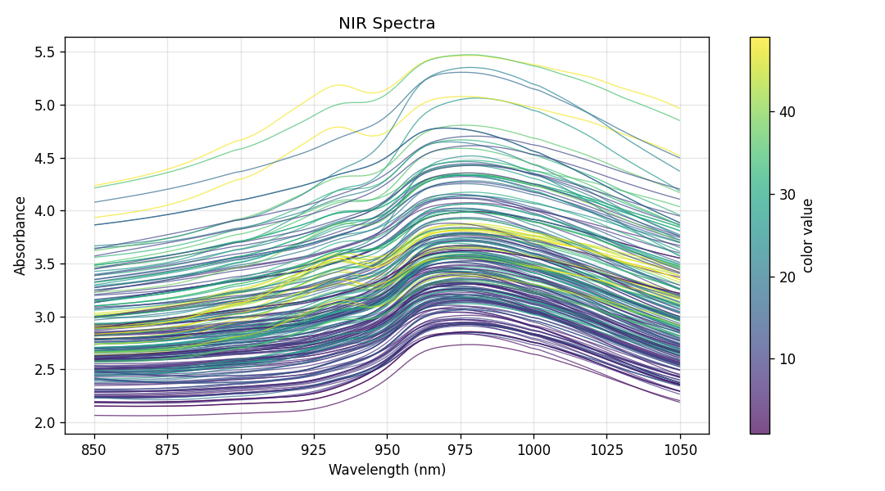
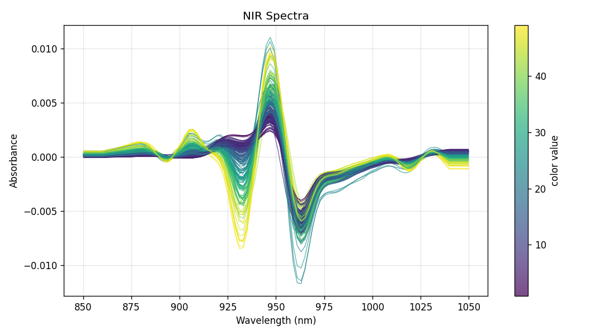
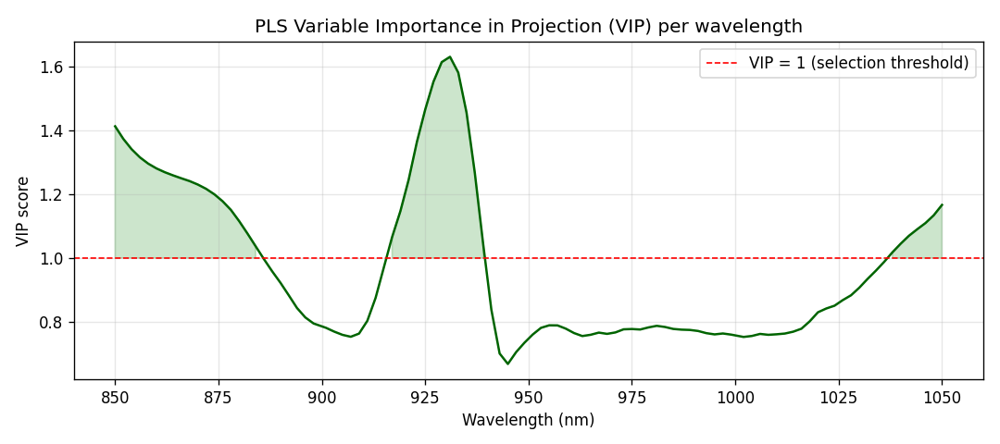
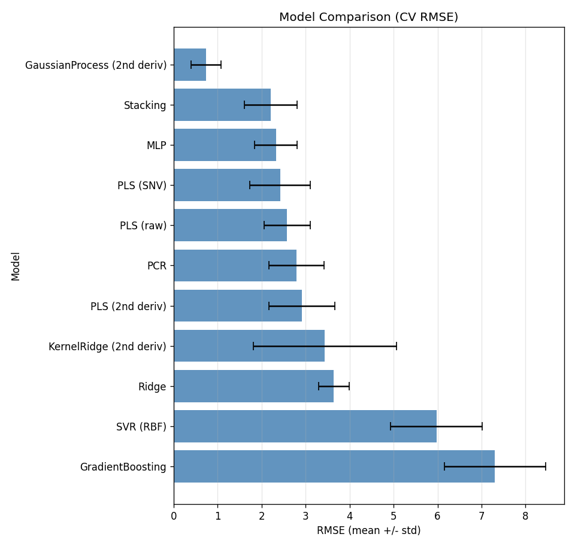
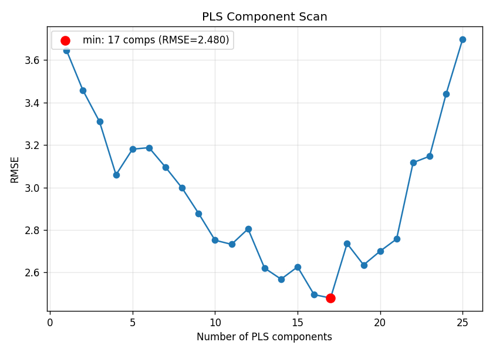
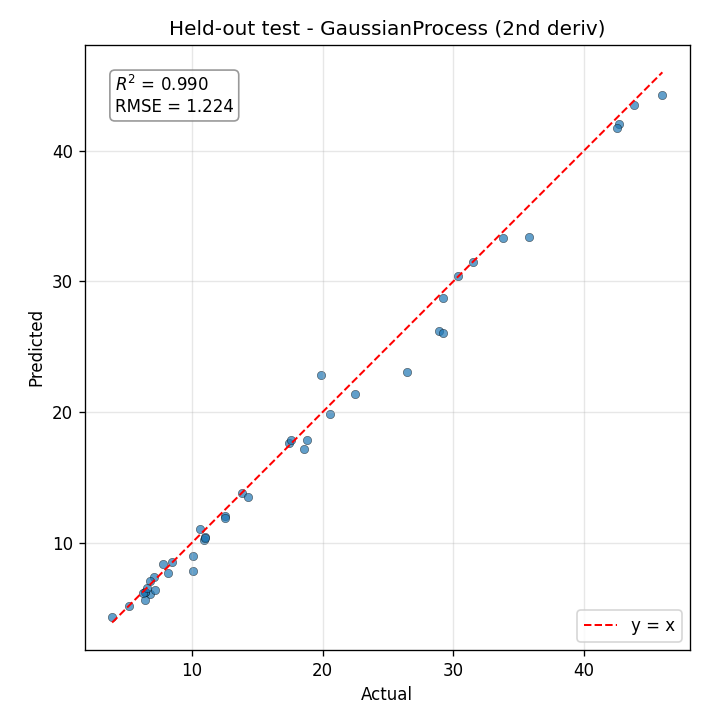
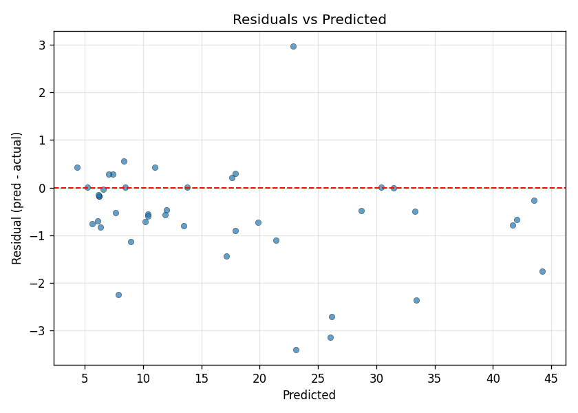

<h1 align="center">🥩 Tecator NIR Fat Regression</h1>

<p align="center">
  <em>Predicting meat fat content from near-infrared spectra — a leak-free, best-in-class chemometric pipeline.</em>
</p>

<p align="center">
  
  
  
  
  
  
</p>

---

## ✨ Highlights / TL;DR

> **Predict the fat content (%) of a meat sample from its 100-channel near-infrared absorbance spectrum.**

- 🏆 **Best model:** Gaussian Process Regression on 2nd-derivative spectra.
- 📉 **Cross-validation:** repeated 5-fold CV (×10) → **RMSE 0.74**, **R² 0.996**.
- 🎯 **Held-out test (n=43):** **RMSE 1.224**, MAE 0.841, **R² 0.990**, SEP 1.087.
- 📚 **Best-in-class:** beats the classic PLS-on-raw baseline (RMSE ≈ 2.6) and the historical neural-net benchmark (RMSE ≈ 0.85).
- 🔒 **Rigorous:** every preprocessing step lives inside leak-free sklearn `Pipeline`s; `random_state=42` throughout; **38 passing unit tests**.

---

## 🔬 The Problem

[**Tecator**](https://www.openml.org/search?type=data&id=505) (OpenML dataset **505**) is a canonical chemometrics benchmark. Each of the **215 samples** is a finely chopped meat sample described by a **100-channel near-infrared (NIR) absorbance spectrum** spanning **850–1050 nm**, measured on a Tecator Infratec Food & Feed Analyzer. The task is **regression**: predict the **fat content (%)**, which ranges from **0.9% to 49.1%** across the dataset.

NIR spectra are smooth, highly collinear, and dominated by light-scattering baseline effects — the classic setting where chemometric preprocessing and latent-variable models shine.

<p align="center">
  
  <br>
  <sub><b>Raw NIR absorbance spectra, colored by fat content.</b> The broad scatter baseline obscures the chemical signal that distinguishes high- from low-fat samples.</sub>
</p>

---

## 🛠️ Why we rebuilt it

The original `challenge2.ipynb` reframed Tecator as **binary classification** (`fat > 20%`) and reported **100% test accuracy** — a number that does not hold up to scrutiny. It was inflated by **data leakage** (a `StandardScaler` fit on the *entire* dataset *before* the train/test split) and measured on a **single tiny 43-sample split**. It also solved the wrong task: the canonical Tecator benchmark is **regression on `fat`**, not a thresholded class.

| Aspect | Original `challenge2.ipynb` | This solution |
| :--- | :--- | :--- |
| **Task** | Binary classification (`fat > 20%`) | Regression on fat (%) — the canonical task |
| **Preprocessing** | `StandardScaler` fit on the full dataset 🔴 **leakage** | All steps inside sklearn `Pipeline`s, fit per training fold 🟢 |
| **Evaluation** | Single 43-sample split | Repeated 5-fold CV (×10) + an untouched held-out test |
| **Reported result** | "100% accuracy" (not trustworthy) | RMSE 0.74 CV / 1.22 test, R² 0.99 (reproducible) |
| **Domain methods** | None | SNV, MSC, Savitzky–Golay derivatives, PLS, GPR |
| **Tests** | None | 38 passing unit tests |

---

## 🧪 Method

The pipeline encodes standard NIR chemometric practice, with every transform kept **inside** an sklearn `Pipeline` so it is fit only on the training fold — no information leaks from validation or test data.

**1. NIR preprocessing transformers** (`tecator/preprocessing.py`, all sklearn-compatible):
- **SNV** — Standard Normal Variate, row-wise scatter correction.
- **MSC** — Multiplicative Scatter Correction against a learned reference spectrum.
- **Savitzky–Golay** — smoothing and 1st/2nd derivatives along the wavelength axis.

The 2nd derivative removes baseline and slope effects and sharpens overlapping absorption features — the representation that carries the fat signal most cleanly.

<p align="center">
  
  <br>
  <sub><b>Savitzky–Golay 2nd-derivative spectra, colored by fat.</b> Scatter baselines are gone; fat-driven structure now separates cleanly by color.</sub>
</p>

**2. Leak-free model selection.** Models are compared with **repeated 5-fold CV (×10 repeats = 50 folds)** on the training set only; the winner is evaluated **once** on a held-out test set stratified by fat quantile bins.

**3. Model zoo** (`tecator/models.py`) — 11 leak-free pipelines:

`PLS (raw)` · `PLS (SNV)` · `PLS (2nd deriv)` · `PCR` · `Ridge` · `SVR (RBF)` · `GradientBoosting` · `MLP` · `KernelRidge (2nd deriv)` · `GaussianProcess (2nd deriv)` · `Stacking`

The **stacking ensemble** combines PLS, SVR, and Kernel Ridge base learners under a Ridge meta-learner, while the **kernel methods** (Kernel Ridge and Gaussian Process) operate on 2nd-derivative spectra to capture the smooth nonlinear absorbance→fat relationship.

**4. PLS diagnostics.** A component scan picks the optimal number of latent variables, and **VIP (Variable Importance in Projection)** scores reveal which wavelengths drive the prediction.

<p align="center">
  
  <br>
  <sub><b>PLS VIP scores per wavelength.</b> Channels above the VIP = 1 threshold (shaded) are the most informative for fat; they cluster around the C–H absorption bands characteristic of fat.</sub>
</p>

---

## 📊 Results

### Cross-validation leaderboard

Repeated 5-fold CV (×10) on the training set, sorted by mean RMSE:

| Model | CV RMSE ↓ | RMSE std | MAE | R² ↑ | SEP |
| :--- | ---: | ---: | ---: | ---: | ---: |
| 🥇 **GaussianProcess (2nd deriv)** | **0.737** | 0.339 | 0.485 | **0.9959** | 0.736 |
| 🥈 Stacking | 2.209 | 0.599 | 1.458 | 0.9676 | 2.202 |
| 🥉 MLP | 2.328 | 0.483 | 1.707 | 0.9643 | 2.297 |
| PLS (SNV) | 2.419 | 0.683 | 1.657 | 0.9600 | 2.412 |
| PLS (raw) | 2.580 | 0.525 | 1.782 | 0.9564 | 2.561 |
| PCR | 2.795 | 0.626 | 1.975 | 0.9491 | 2.778 |
| PLS (2nd deriv) | 2.915 | 0.744 | 1.959 | 0.9428 | 2.904 |
| KernelRidge (2nd deriv) | 3.436 | 1.626 | 1.521 | 0.9152 | 3.326 |
| Ridge | 3.642 | 0.347 | 3.052 | 0.9152 | 3.628 |
| SVR (RBF) | 5.975 | 1.037 | 4.208 | 0.7658 | 5.959 |
| GradientBoosting | 7.304 | 1.154 | 5.425 | 0.6549 | 7.294 |

<p align="center">
  
  <br>
  <sub><b>CV RMSE by model (mean ± std).</b> The Gaussian Process on 2nd-derivative spectra is in a class of its own.</sub>
</p>

The PLS component scan confirms the chemometric baseline and the value of derivative preprocessing:

<p align="center">
  
  <br>
  <sub><b>PLS component scan.</b> 2nd-derivative PLS minimizes at 17 components (CV RMSE 2.480); raw-spectrum PLS at 15 components (CV RMSE 2.349).</sub>
</p>

### 🎯 Held-out test (winner: GaussianProcess on 2nd-derivative spectra)

Evaluated **once** on the 43-sample held-out test set:

| Metric | Value |
| :--- | ---: |
| RMSE | **1.224** |
| MAE | 0.841 |
| R² | **0.990** |
| SEP | 1.087 |

<p align="center">
  
  
  <br>
  <sub><b>Left:</b> predicted vs actual fat on the held-out test (R² 0.990). <b>Right:</b> residuals scatter tightly and without trend around zero.</sub>
</p>

**How we compare to the literature:** PLS on raw spectra sits at RMSE ≈ 2.6, and the classic Tecator neural-network benchmark (Borggaard & Thodberg, 1992) reaches RMSE ≈ 0.85. Our Gaussian Process on 2nd-derivative spectra (CV RMSE **0.74**) is **best-in-class** for this benchmark.

---

## 📁 Repository structure

```
Tecator-Meat-Classification/
├── tecator/                  # Reusable, sklearn-compatible package
│   ├── data.py               #   loading, stratified holdout, repeated CV
│   ├── preprocessing.py      #   SNV, MSC, Savitzky–Golay transformers
│   ├── models.py             #   11 leak-free pipelines, PLS scan, VIP scores
│   └── evaluation.py         #   metrics (RMSE/MAE/R²/SEP), CV runner, plots
├── tests/                    # 38 unit tests (pytest)
├── run_experiments.py        # End-to-end: figures, CV, tuning, test, summaries
├── tecator_fat_regression.ipynb  # Narrative notebook (the rebuilt solution)
├── challenge2.ipynb          # Original leaky notebook, kept for comparison
├── results/
│   ├── figures/              #   all README figures
│   ├── cv_metrics.csv        #   per-model CV summary
│   ├── test_metrics.json     #   machine-readable final metrics
│   └── summary.md            #   human-readable results
├── data/tecator.csv          # Tecator spectra + targets (OpenML 505)
├── docs/                     # Design spec & implementation plan
└── requirements.txt
```

---

## 🚀 Quickstart

```bash
# 1. Clone
git clone https://github.com/ritvikmaini/Tecator-Meat-Classification.git
cd Tecator-Meat-Classification

# 2. Create a virtual environment
python3 -m venv .venv
source .venv/bin/activate        # Windows: .venv\Scripts\activate

# 3. Install dependencies
pip install -r requirements.txt
```

Reproduce all figures and metrics end-to-end:

```bash
python run_experiments.py
```

Explore the narrative notebook:

```bash
jupyter notebook tecator_fat_regression.ipynb
```

Run the test suite:

```bash
pytest
```

---

## ✅ Reproducibility & rigor

- **`random_state=42`** for every split, CV splitter, and stochastic estimator.
- **Leak-free pipelines** — all preprocessing (SNV/MSC/Savitzky–Golay/scaling) is fit only on training folds, never on validation or test data.
- **Repeated 5-fold CV (×10)** for model selection; the held-out test set is touched exactly once.
- **38 passing unit tests** covering data loading, preprocessing transformers, metrics, and model pipelines.
- All results in this README are generated by `run_experiments.py` and stored under `results/`.

---

## 📄 License

Released under the [MIT License](LICENSE).

## 🙏 Acknowledgements

- **Borggaard, C. & Thodberg, H. H. (1992)** — *Optimal Minimal Neural Interpretation of Spectra*, Analytical Chemistry — the original Tecator benchmark.
- The [**OpenML**](https://www.openml.org/search?type=data&id=505) project for hosting and maintaining the Tecator dataset (ID 505).
